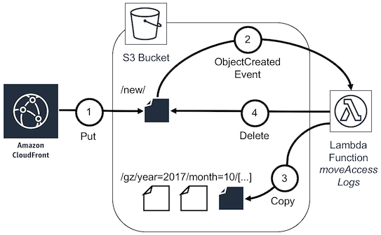
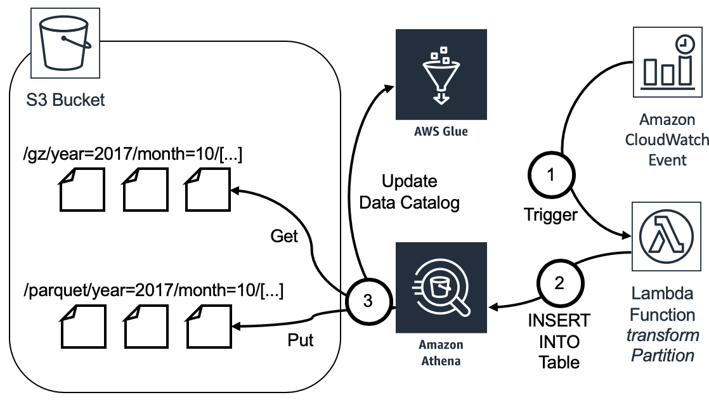

# Analyzing your Amazon CloudFront access logs at scale

This is a sample implementation for the concepts described in the AWS blog post [_Analyze your Amazon CloudFront access logs at scale_](https://aws.amazon.com/blogs/big-data/analyze-your-amazon-cloudfront-access-logs-at-scale/) using
[AWS CloudFormation](https://aws.amazon.com/cloudformation/),
[Amazon Athena](https://aws.amazon.com/athena/),
[AWS Glue](https://aws.amazon.com/glue/),
[AWS Lambda](https://aws.amazon.com/lambda/), and
[Amazon Simple Storage Service](https://aws.amazon.com/s3/) (S3).

This application is available in the AWS Serverless Application Repository. You can deploy it to your account from there:

[](https://serverlessrepo.aws.amazon.com/#/applications/arn:aws:serverlessrepo:us-east-1:387304072572:applications~amazon-cloudfront-access-logs-queries)

## Overview

The application has two main parts:

- An S3 bucket `<StackName>-cf-access-logs` that serves as a log bucket for Amazon CloudFront access logs. As soon as Amazon CloudFront delivers a new access logs file, an event triggers the AWS Lambda function `moveAccessLogs`. This moves the file to an [Apache Hive style](https://cwiki.apache.org/confluence/display/Hive/LanguageManual+DDL#LanguageManualDDL-AlterPartition) prefix.

    

- An hourly scheduled AWS Lambda function `transformPartition` that runs an [INSERT INTO](https://docs.aws.amazon.com/athena/latest/ug/insert-into.html) query on a single partition per run, taking one hour of data into account. It writes the content of the partition to the Apache Parquet format into the `<StackName>-cf-access-logs` S3 bucket.

    

## FAQs

### Q: How can I get started?

Use the _Launch Stack_ button above to start the deployment of the application to your account. The AWS Management Console will guide you through the process. You can override the following parameters during deployment:

- The `NewKeyPrefix` (default: `new/`) is the S3 prefix that is used in the configuration of your Amazon CloudFront distribution for log storage. The AWS Lambda function will move the files from here.
- The `GzKeyPrefix` (default: `partitioned-gz/`) and `ParquetKeyPrefix` (default: `partitioned-parquet/`) are the S3 prefixes for partitions that contain gzip or Apache Parquet files.
- `ResourcePrefix` (default: `myapp`) is a prefix that is used for the S3 bucket and the AWS Glue database to prevent naming collisions.

The stack contains a single S3 bucket called `<ResourcePrefix>-<AccountId>-cf-access-logs`. After the deployment you can modify your existing Amazon CloudFront distribution configuration to deliver access logs to this bucket with the `new/` log prefix.

As soon Amazon CloudFront delivers new access logs, files will be moved to `GzKeyPrefix`. After 1-2 hours, they will be transformed to files in `ParquetKeyPrefix`.

You can query your access logs at any time in the [Amazon Athena Query editor](https://console.aws.amazon.com/athena/home#query) using the AWS Glue view called `combined` in the database called `<ResourcePrefix>_cf_access_logs_db`:

```sql
SELECT * FROM cf_access_logs.combined limit 10;
```

### Q: How can I customize and deploy the template?

1. [Fork](https://github.com/aws-samples/amazon-cloudfront-access-logs-queries#fork-destination-box) this GitHub repository.
2. Clone the forked GitHub repository to your local machine.
3. Modify the templates.
4. Install the [AWS CLI](https://docs.aws.amazon.com/cli/latest/userguide/installing.html)
    & [AWS Serverless Application Model (SAM) CLI](https://docs.aws.amazon.com/serverless-application-model/latest/developerguide/serverless-sam-cli-install.html).
5. Validate your template:

    ```sh
    $ sam validate -t template.yaml
    ```

6. Package the files for deployment with SAM (see [SAM docs](https://docs.aws.amazon.com/serverless-application-model/latest/developerguide/serverless-deploying.html) for details) to a bucket of your choice. The bucket's region must be in the region you want to deploy the sample application to:

    ```sh
    $ sam package
        --template-file template.yaml
        --output-template-file packaged.yaml
        --s3-bucket <BUCKET>
    ```

7. Deploy the packaged application to your account:

    ```sh
    $ aws cloudformation deploy
        --template-file packaged.yaml
        --stack-name my-stack
        --capabilities CAPABILITY_IAM
    ```

### Q: How can I use the sample application for multiple Amazon CloudFront distributions?

Deploy another AWS CloudFormation stack from the same template to create a new bucket for different distributions or environments. The stack name is added to all resource names (e.g. AWS Lambda functions, S3 bucket etc.) so you can distinguish the different stacks in the AWS Management Console.

### Q: In which region can I deploy the sample application?

The _Launch Stack_ button above opens the AWS Serverless Application Repository in the US East 1 (Northern Virginia) region. You may switch to other regions from there before deployment.

### Q: How can I add a new question to this list?

If you found yourself wishing this set of frequently asked questions had an answer for a particular problem, please [submit a pull request](https://help.github.com/articles/creating-a-pull-request-from-a-fork/). The chances are good that others will also benefit from having the answer listed here.

### Q: How can I contribute?

See the [Contributing Guidelines](https://github.com/aws-samples/amazon-cloudfront-access-logs-queries/blob/master/CONTRIBUTING.md) for details.

## License Summary

This sample code is made available under a modified MIT license. See the [LICENSE](https://github.com/aws-samples/amazon-cloudfront-access-logs-queries/blob/master/LICENSE) file.
